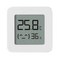

# Xiaomi-Mijia-Bluetooth-Temperature-and-Humidity-Sensor-V2


## Compile
```
gcc test_sensor.c -lbluetooth -o test_sensor
```

## Usage
root# ./test_sensor A4:C1:38:XX:XX:XX

## hcitool

### Connect
```
root# hcitool lecc A4:C1:38:XX:XX:XX
Connection handle 64
root#
```

### Dump
```
root#  hcidump -X
HCI sniffer - Bluetooth packet analyzer ver 2.5
device: hci0 snap_len: 1500 filter: 0xffffffff
> ACL data: handle 64 flags 0x02 dlen 12
    ATT: Handle notify (0x1b)
      handle 0x0036
      value 0xad 0x08 0x31 0x2a 0x0c
root#
```
Temperature: `0x08ad = 22.21℃`  
Humidity: `0x31 = 49%`  

### Disconnect
```
root# hcitool ledc 64
root#
```
